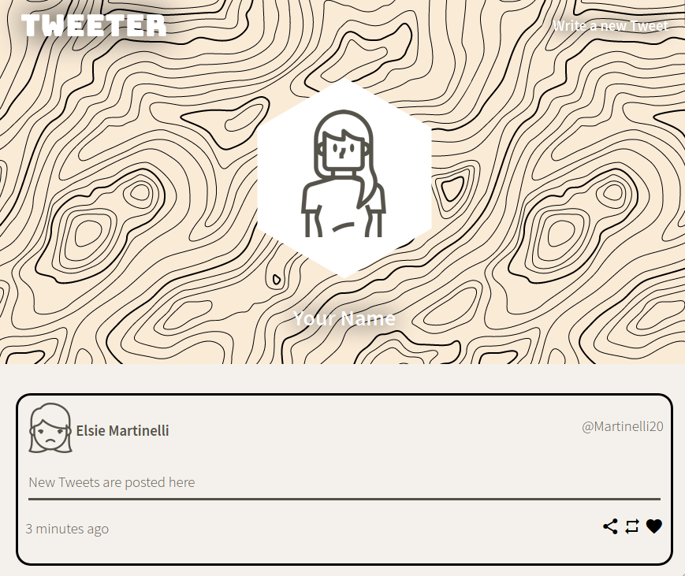
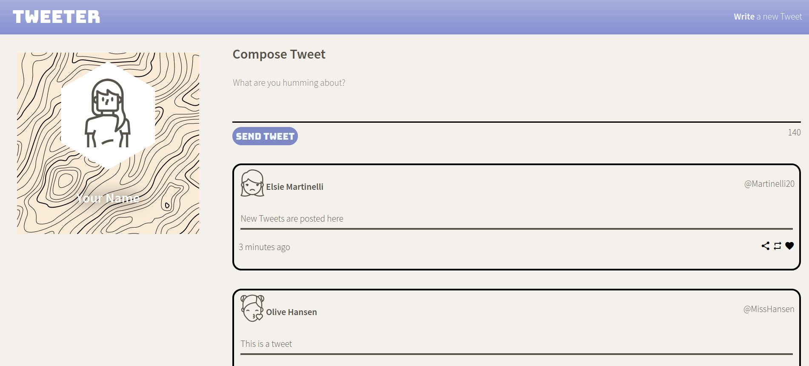
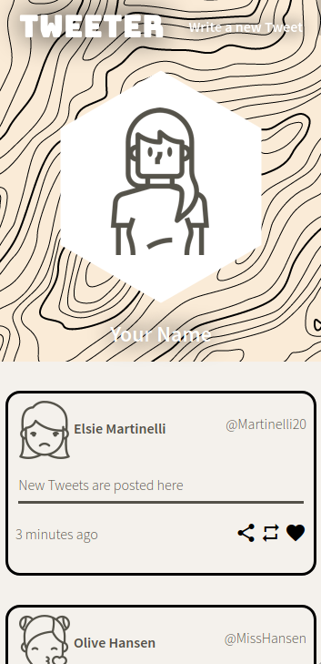

# Tweeter Project

Tweeter is a simple, single-page Twitter clone.

A Twitter clone made to practice our CSS and frontend skills, learning about AJAX calls, responsive design, and single page applications.

## Examples

 

## Getting Started

- Install all dependencies (using the `npm install` command).
- Run the development web server using the `node start` command.

## Features

- Responsive Design
- Ability to post tweets, with appropriate error messages
- Character Counter
- Collapsible "Write New Tweet" form
- Proper Timestamps
